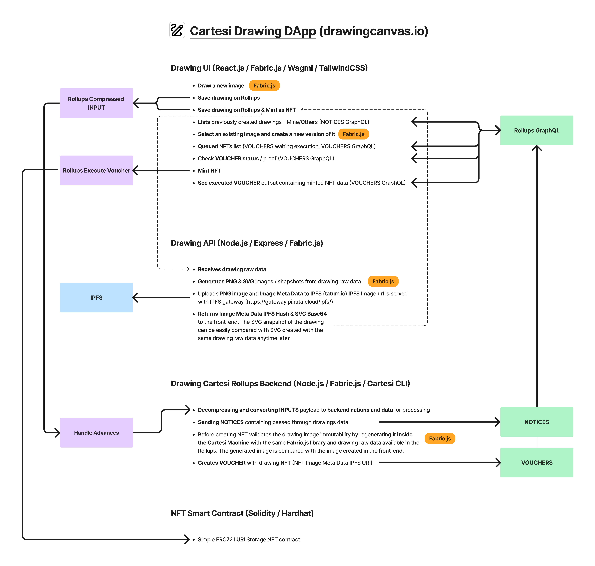

## Drawing DApp

Drawing is a DApp written in JavaScript/ReactJS running on Cartesi Rollups with [Cartesi CLI](https://docs.cartesi.io).

## Requirements

Please refer to [system requirements](https://docs.cartesi.io/cartesi-rollups/1.3/development/installation/) before start building a dApp with Cartesi CLI.

## Epoch

By default the node closes an epoch `once a day`, but this can be controlled by the
`--epoch-duration <seconds>` command option when executing the run dApp command.

It's an important settings when it comes down to `voucher` execution.

## Follow these steps to run the DApp

1. [Install Cartesi CLI (if not available)](#install-cartesi-cli)
2. [Run `cartesi build`](#build-the-application)
3. [Run `cartesi run`](#run-the-dapp)
   - [`cartesi run` options](#cartesi-run-command-options)
4. [Build Smart contracts](#build-the-smart-contract)
5. [Deploy Smart contracts](#deploy-the-smart-contract)
6. [Interacting with the application](#interacting-with-the-application)
   - [Steps to mint a NFT from a drawing](#steps-to-mint-a-nft-from-a-drawing)

## Building

### Install Cartesi CLI

This project works with [Cartesi CLI](https://docs.cartesi.io), so to run it you should first install Cartesi CLI.

```shell
npm install -g @cartesi/cli
```

### Build the application

To build the application, run the following command from the project's root directory

```shell
cd drawing-rollups-js
cartesi build
```

## Running

### Run the dApp

From the project `root` directory run

```shell
cd drawing-rollups-py
cartesi run
```

### Other useful commands and options

#### Control epoch duration

By default the node closes an epoch `once a day`, but this can be controlled by the
`--epoch-duration <seconds>` command option when executing the run dApp command.

```shell
cartesi run --epoch-duration <seconds>
```

It's an important settings when it comes down to `voucher` execution.

#### Detailed running log

To get a more `detailed running log` run:

```shell
cartesi run --verbose
```

#### Check system status

To check the `system status` on error run:

```shell
cartesi doctor
```

### Shut down

The application can afterwards be shut down with `CTRL+C`

### Running the back-end in host mode

When developing an application, it is often important to easily test and debug it. More details on running the application in development mode here: https://docs.cartesi.io/cartesi-rollups/1.3/development/running-the-application/

### Smart contracts. Building & Deploying.

This dApp needs a smart contract to be able to mint NSTs from canvas drawings.

> Before starting the dApp you have to build and deploy the smart contract.

### Build the smart contract

This is a simple contract to perform operations with NFTs (minting a nft).
You may build the project's `smart contract` as follows.
From the `project's root` directory execute:

```shell
yarn
cd smart-contracts
yarn build
```

### Deploy the smart contract

To deploy the smart contract on localhost from the `project's root` directory execute:

```shell
cd smart-contracts
yarn deploy
```

Manual deployment to other supported testnets can be done by executing `yarn deploy:<network>`.

### Use the smart contract

To use the smart contract, you must first retrieve the contract address from the deployment data.
When deploying the contract manually its address is printed in CLI as follows:

```shell
deploying "DrawingCanvasNFT" (tx: tx-hash)...: deployed at `smart-contract-address` with amount-of-gas-used gas
```

You can also check the address in

```shell
smart-contracts/deploymets/<network-name>/<smart-contract-name>.json, { address: `smart-contract-address`, ...}.
```

The smart `contract's address` is used in the frontend application - (see `drawing-ui/src/config/config.json`) as `ercToMint` for each chain.

## Interacting with the application

To run the frontend application execute from the project `root directory`:

```shell
yarn
yarn dev
```

### Use the frontend `drawing-ui` application to interact with the DApp.

1. Vouchers cannot be executed when running the backend in `host mode`.
2. You should have a wallet (MetaMask) installed in the browser and be able to connect to account in that wallet.
3. When restarting the application be sure to `Clear wallet's activity and nonce data` from Settings - Advanced - Clear activity and nonce data
4. Be sure to have small amount of assets in the wallet account for the dApp interactions.
5. If you restart the dApp, be sure to [redeploy](#building-the-smart-contract-and-deploying-manually) the dApp's smart contract if it's been deployed manually

### `drawing-api` server

In order the frontend to work properly, you need to start a server that will convert the `canvas into a base64 string` and will upload PNG snapshot of the drawing to IPFS.

## [Deploying the application](https://docs.cartesi.io/cartesi-rollups/1.3/deployment/introduction/)

## Steps to mint a NFT from a drawing

1. Draw a picture on canvas
2. Save the canvas & Mint NFT

   For detailed string processing information refer to: drawing-rollups-js

   - emits a voucher - containing

     - destination: (the mint NFT smart contract address),

     - payload: `the Mint Erc721 - tokenURI` and the `owner` of the picture to be minted as a NFT and the NFT itself

   - emits a notice with information about the emited voucher `Emmited voucher to mint ERC721 {erc721 string to mint}`

   - The new `voucher` is accessible at DrawingDapp `Vouchers` tab

3. Execute the voucher

   - You can execute the `voucher` once the current epoch is closed.
   - The newly minted NFT can be imoprted in your wallet by using the `smart contract address` and the `id` of the minted NFT.
